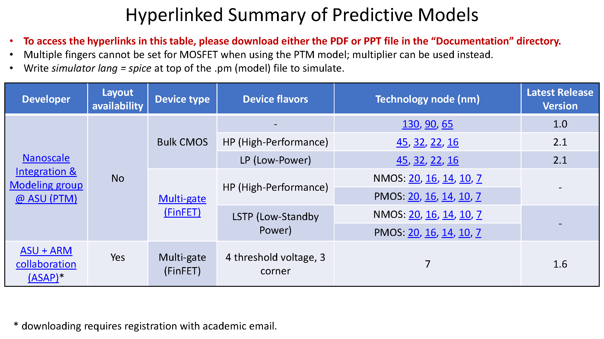

Copyright 2020

Licensed under the Apache License, Version 2.0 (the "License");
you may not use this file except in compliance with the License.
You may obtain a copy of the License at

    http://www.apache.org/licenses/LICENSE-2.0

Unless required by applicable law or agreed to in writing, software
distributed under the License is distributed on an "AS IS" BASIS,
WITHOUT WARRANTIES OR CONDITIONS OF ANY KIND, either express or implied.
See the License for the specific language governing permissions and
limitations under the License.

# AMPSE 
This is the repository of IPs of the group in USC who is developing Analog Mixed-signal Parameter Search Engine (AMPSE). You can download IPs generated by AMPSE or parameterized IPs with neural network based parameter-metric regression models. Watch this repository and follow USCPOSH on GitHub for our further updates!  USC POSH Group: https://github.com/USCPOSH

